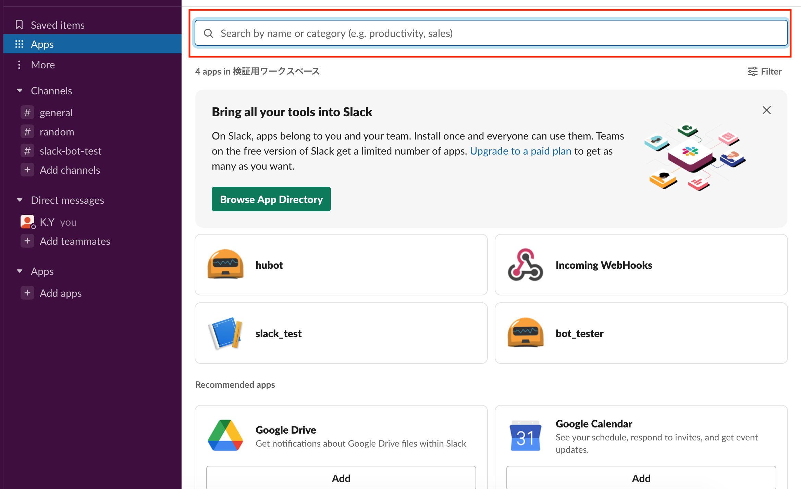
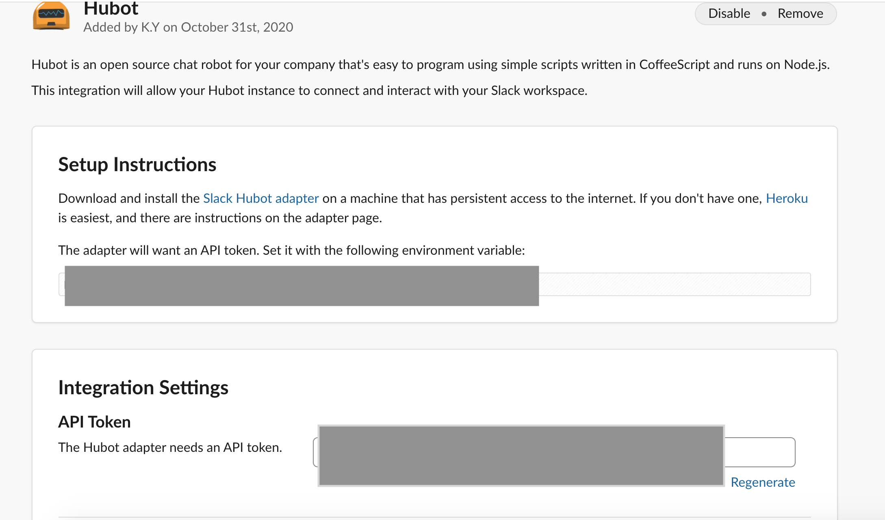

# Weather Notice Slack Bot
A slack bot that tells you the weather when you ask the bot "weather ???"

## Prerequisites
* python-dotenv - Library for managing environment variables
* requests - library for sending http get and post requests (used here to send get request to OpenWeatherMap API)
* slackbot - Library for interacting with bots

## How to run the script
Python 3.8

you can use install first with pip install -r requirements.txt

and then run with command python run.py

## Start with creating a new app in slack as a bot
**First You create a workspace and click "add app".**

**You search "hubot" and click "add".**

**Redirect to slack settings page and get API token.**

**You set the API Token in .env.**

**Then get the API Key for the OpenWeather API**

**Setting API Key .env in the same way as Hubot API Token.**

**Now that you’ve done this your app should be ready.**

**Running run.py and ask hubot the weather.**

## *Author Name*
@kazuyoshi-tech
https://github.com/kazuyoshi-tech